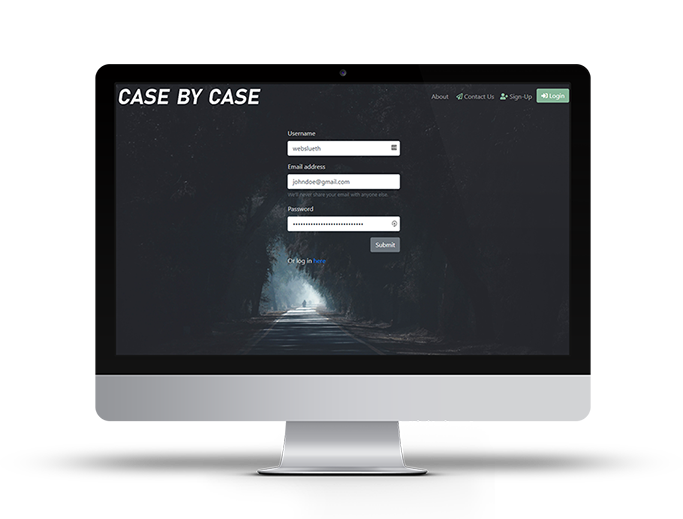
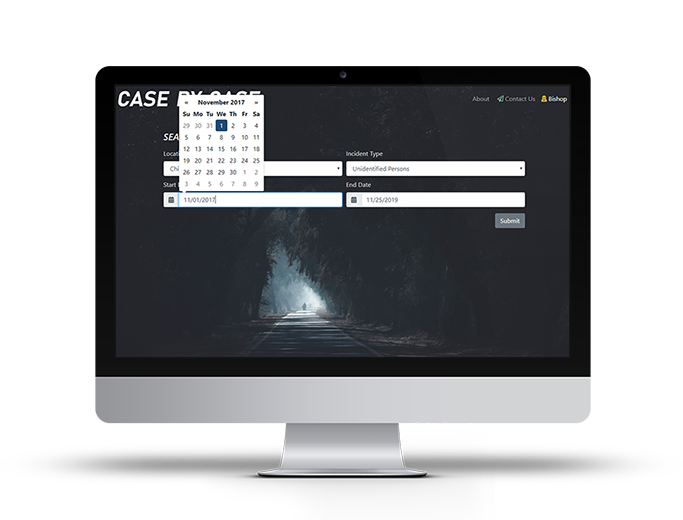
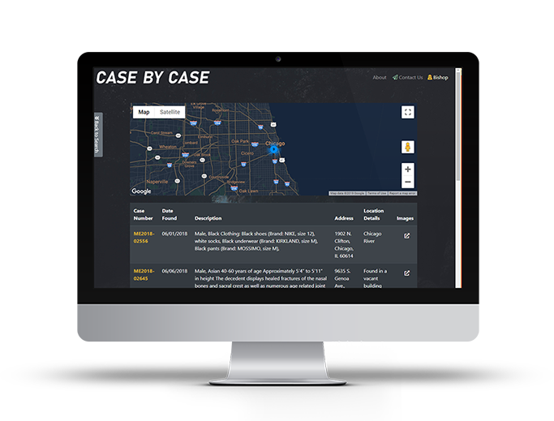
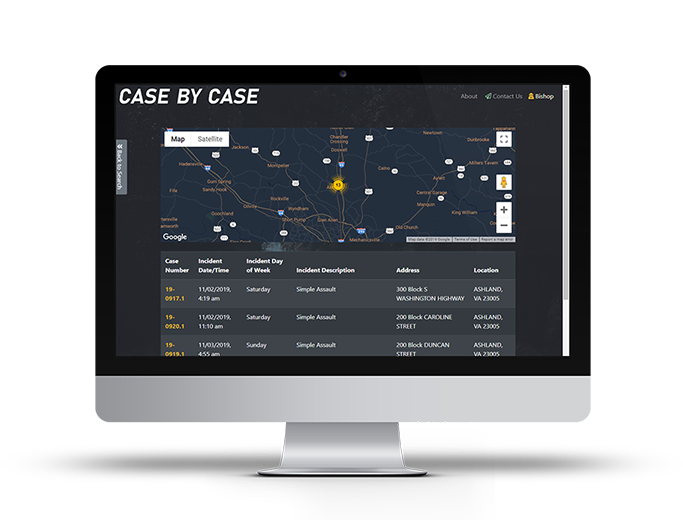

     

## Overview
There is no central database of all police activity for the country. There is not even a database for each state. Typically the most you will find is at the city or county level, but not all of them have that information online. Because of all this there is a significant lack of publicly available databases regarding crimes, cold cases, and missing persons cases. There are different software vendors to manage the various aspects of police paperwork so there is no universal standard. This leaves a bunch of isolated databases that are unable to communicate or interface data seamlessly. With roadblocks like these, there is no wonder that the closure rates for cases are so low. This has brought to the forefront the use of amateur sleuths that use the internet to help law enforcement close these cases and bring closure to the affected families. **Case by Case** takes these isolated databases and gives the user the capability to search them all in one form submission.

## Languages/Technologies Used
- HTML, CSS, JavaScript
- [jQuery 3.4.1](http://code.jquery.com/)
- [Bootstrap 4.3.1](https://getbootstrap.com/docs/4.3)
- [Node](https://nodejs.org/en/docs/)
    - [Express 4.x](https://expressjs.com/en/4x/api.html)
    - [Express-Handlebars 3.1.0](https://www.npmjs.com/package/express-handlebars)
    - [MySQL2 1.6.5](https://www.npmjs.com/package/mysql2)
    - [Sequelize 5.x](https://sequelize.org/master/)
    - [Passport 0.4.0](http://www.passportjs.org/docs/)
    - [bcryptjs 2.4.3](https://www.npmjs.com/package/bcryptjs)
- [Moment.js 2.24.0](https://momentjs.com/)
- [Font Awesome 5.10.2](https://fontawesome.com/how-to-use/on-the-web/referencing-icons/basic-use)
- APIs
    - [Socrata Crime Data](https://moto.data.socrata.com/)
    - [Google Maps](https://developers.google.com/maps/documentation)
- [NamUs Public Data](https://public.opendatasoft.com/explore/dataset/namus-missings/information/)

## Getting Started
Visit https://nameless-gorge-05262.herokuapp.com/.

### Prerequisites
- An internet browser with JavaScript enabled.
- A Case By Case account.

### Instructions
#### Sign-Up for a Case By Case Account
Users should click the **Sign-Up** button, then enter their desired username, their email address, and a password.

#### Login to Case By Case
Users should over over the **Login** button, then enter their username and password. Click **Log In** to complete the process.

#### Searching
Once you've logged in, click the drop to select a **Location**, an **Incident Type**, and then set your **Start Date** and **End Date** using the calendar picker. Then, click submit.

##### Missing Person
Selecting the *Missing Person* option from the **Incident Type** drop-down will allow you to search the NamUs database.

For each case found, the following information will be retrieved:
- Name
- Image (*if available*)
- Area of Last Contact
- Date of Last Contact
- Age at Time of Disappearance
- Current Age
- Race/Ethnicity
- Gender

You may also click the link button to view the case on NamUs' website.

##### Unidentified Persons
Selecting the *Unidentified Persons* option from the **Incident Type** drop-down will allow you to search the Socrata APIs for deceased individuals who have not yet been identified.

For each case found, the following information will be retrieved:
- Case Number
- Date Found
- Description
- Address
- Location Details
- Images (*if available*)

> Please be advised that some images may be graphic.

##### Other
All other search types query various Socrata APIs for incident information from local police departments.

For each incident found, the following information will be retrieved:
- Case Number
- Incident Date/Time
- Incident Day of Week
- Incident Description
- Address
- Location

